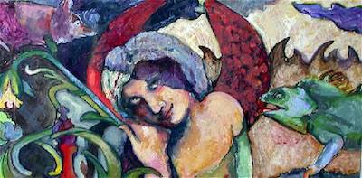

Danielle Fogel

### Biography

Danielle Fogel was born in St. Petersburg, Florida, in 1970 and spent her formative years in Houston, Texas. In her youth, she was surrounded by warm Southerners whom she credits for fostering an internal dialogue of symbols to describe life's events, both exceptional and mundane.

Danielle traveled west to study at the San Francisco Art Institute. There, exposure to many new philosophies, helped broaden her iconographical vocabulary. Danielle resides in Fairfax, California, with her husband, Peter, and their two spirited children, Lisette and Stefan.

### Contact me

[d.fogel@comcast.net](mailto:d.fogel@comcast.net)